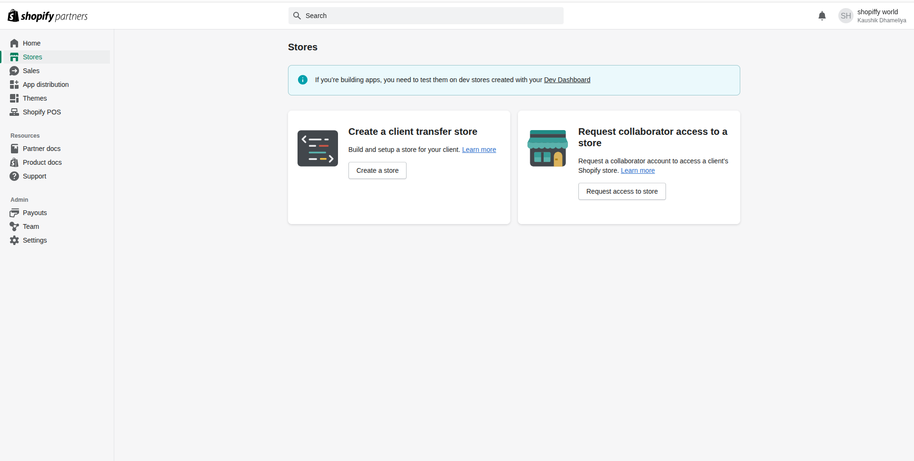
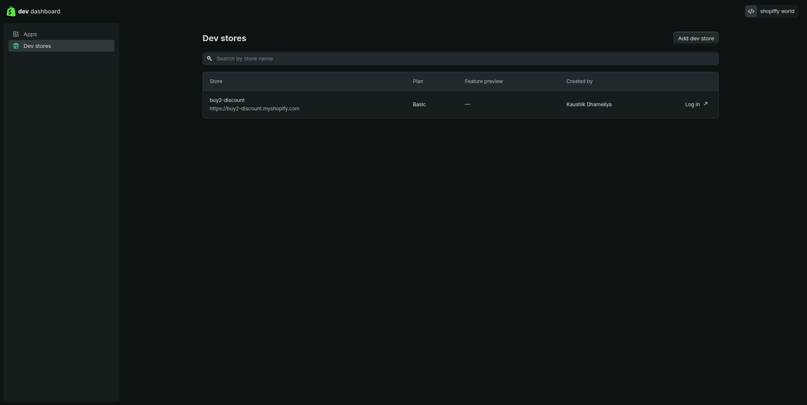
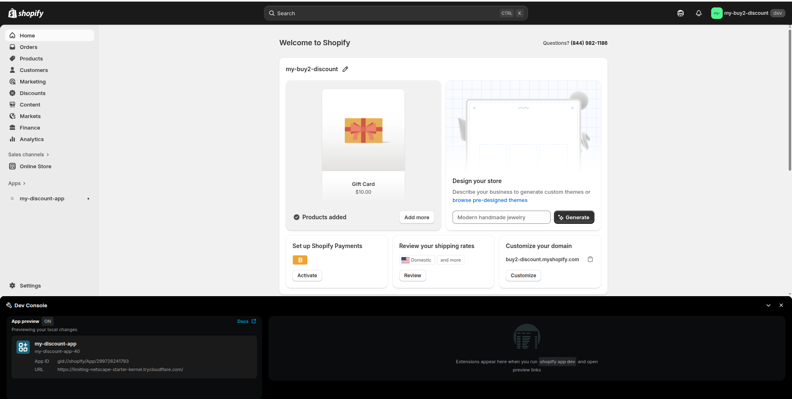
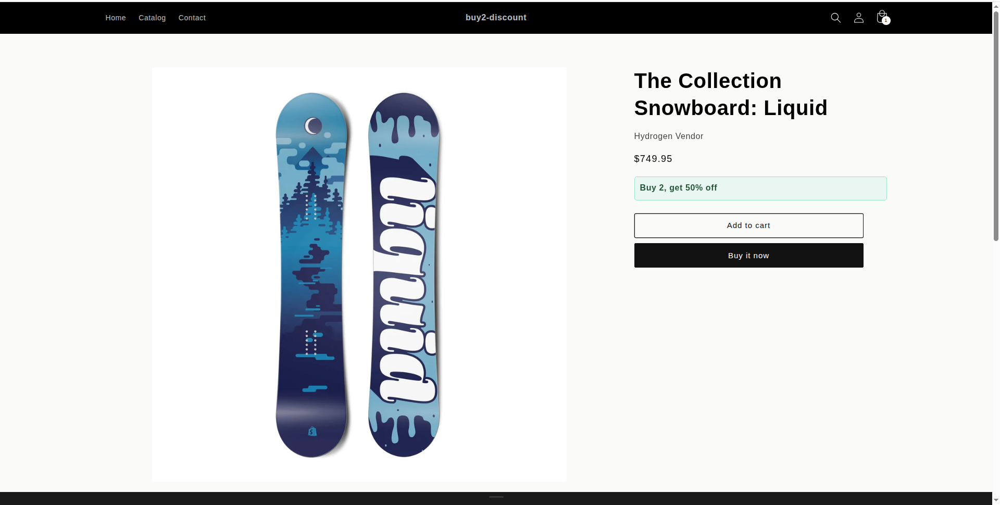
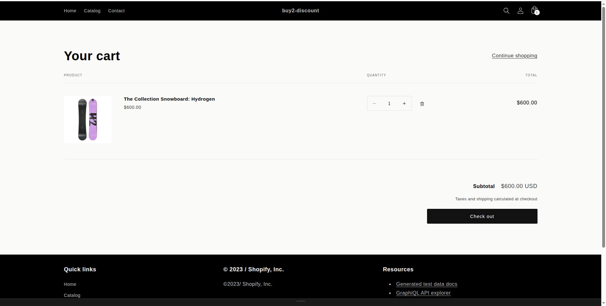
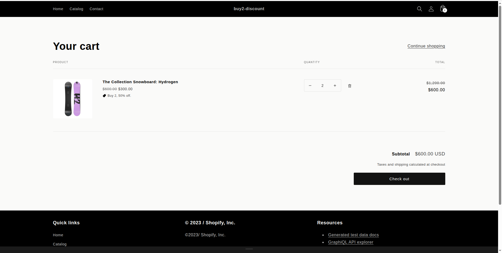
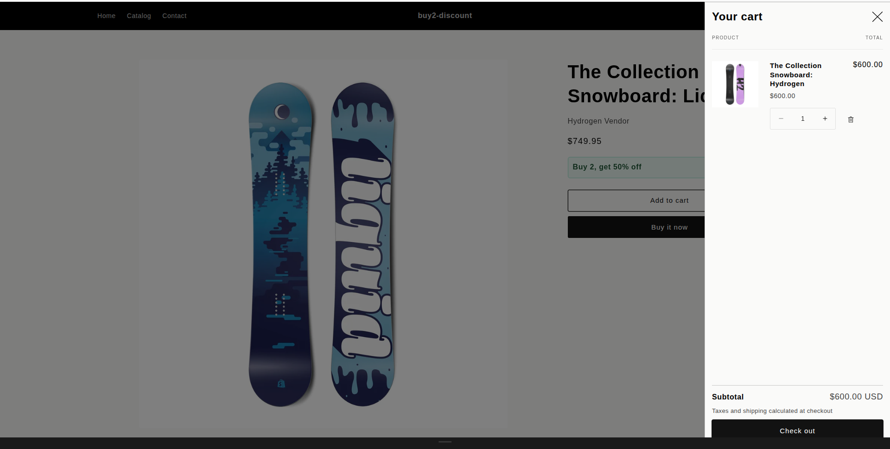
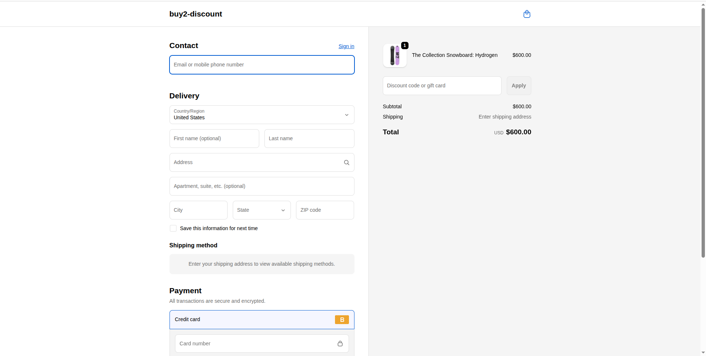
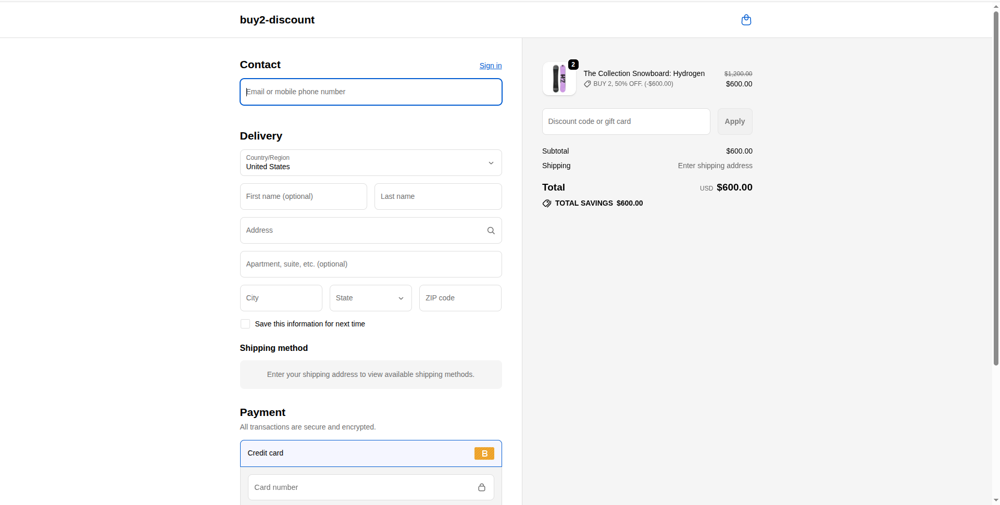

# Shopify Discount Function + Product Page(PDP) Cart Widget

- Shopify provides pre-built, ready-to-use app templates, so you don’t need to make an app from scratch; find them and make the core things.
- Creates a “Buy 2, get X% off” discount using Shopify Functions (automatic discount).
- Let's an admin choose which product(s) and what % from the app’s UI.
- Stores admin choices in metafields.
- Shows a small theme app extension widget on the Product page (and optionally Cart) that says e.g. “Buy 2, get 10% off”.

## Quick start

### Prerequisites

Before you begin, you'll need the following:

1. **Node.js**: [Download and install](https://nodejs.org/en/download/) it if you haven't already.
2. **Shopify Partner Account**: [Create an account](https://partners.shopify.com/signup) if you don't have one.
3. **Test Store**: Set up either a [development store](https://help.shopify.com/en/partners/dashboard/development-stores#create-a-development-store) or a [Shopify Plus sandbox store](https://help.shopify.com/en/partners/dashboard/managing-stores/plus-sandbox-store) for testing your app.
4. **Shopify CLI**: [Download and install](https://shopify.dev/docs/apps/tools/cli/getting-started) it if you haven't already.
```shell
npm install -g @shopify/cli@latest
```

### Setup

```shell
shopify app init --template=https://github.com/Shopify/shopify-app-template-react-router
```

### Local Development

```shell
shopify app dev
```

Press P to open the URL to your app. Once you click install, you can start development.

Local development is powered by [the Shopify CLI](https://shopify.dev/docs/apps/tools/cli). It logs into your partners account, connects to an app, provides environment variables, updates remote config, creates a tunnel and provides commands to generate extensions.


### Build

Build the app by running the command below with the package manager of your choice:

Using yarn:

```shell
yarn build
```

Using npm:

```shell
npm run build
```

Using pnpm:

```shell
pnpm run build
```
## Screenshots

### 1. Partner Account


### 2. Development Store


### 3. My Discount App


### 4. PDP Discount Block


### 5. Product Without Discount


### 6. Product With Discount


### 7. Single Product in Cart


### 8. Checkout Cart Without Discount


### 9. Checkout Cart With Discount


## 10. Recording

